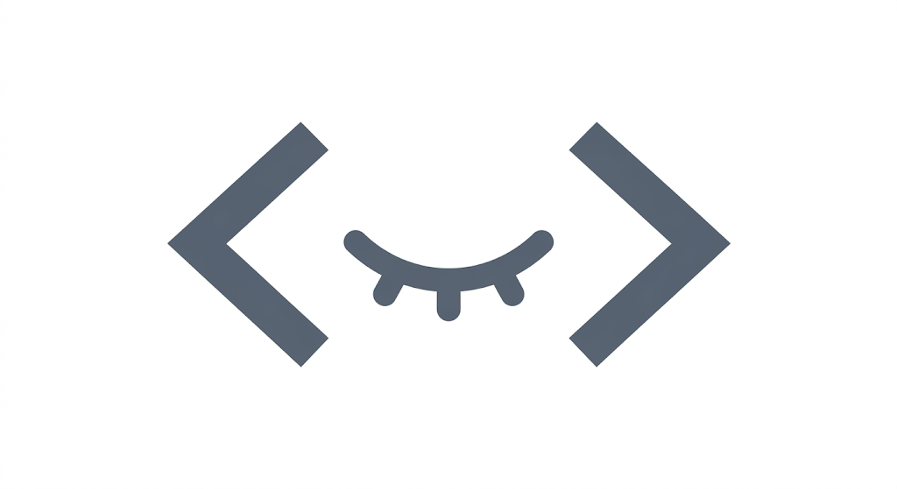

<p align="center">
  
</p>

<h1 align="center">Zozzer 🌙</h1>

<p align="center">
  <em>A minimalist DSA notebook for competitive programmers.</em><br />
  <sub>for the coder who grinds through the night</sub>
</p>

<p align="center">
  <a href="https://react.dev"></a>
  <a href="https://www.typescriptlang.org/"></a>
  <a href="https://vite.dev"></a>
  <a href="https://tailwindcss.com"></a>
  <a href="https://ui.shadcn.com"></a>
  <a href="https://groq.com"></a>
</p>

---

> *"Know thy weakness, & thou shalt know thy path."*

## What is Zozzer?

A personal DSA problem tracker built for the grind. Log your problems, track weak topics, and let AI tell you what to revise first — all in **under 10 minutes a day**.

No accounts. No backend. Everything persists in **localStorage**.

---

## Features

| Feature | Description |
|--------|-------------|
| 📝 **Problem logging** | Name, topic, difficulty, understanding, upsolve flag, auto date |
| 🧠 **AI topic suggestions** | Groq classifies the topic as you type the problem name |
| 📊 **Weakness index** | Per-topic score from hard-to-understand % + upsolve % |
| 🔮 **Oracle analysis** | Ranked revision list with AI reasoning |
| ⚠️ **Revision reminders** | Alerts when weak topics (>60%) go untouched 7+ days |
| 🔥 **Daily streak** | Consecutive days with at least one problem logged |
| 🗂 **Topic index** | Drill into any topic, sorted weakest-first |

---

## Tech Stack

- **React 19** + **TypeScript**
- **Vite 8**
- **Tailwind CSS 4** + **shadcn/ui**
- **Groq API** — `llama-3.3-70b-versatile`
- **localStorage** — all data stays in your browser

---

## Getting Started

### 1. Clone & install

```bash
git clone https://github.com/<your-username>/zozzer.git
cd zozzer
npm install
```

### 2. Add your Groq API key

Copy the example env file and add your key:

```bash
cp .env.example .env
```

```env
VITE_GROQ_API_KEY=gsk_your_key_here
```

Get a free key at [console.groq.com/keys](https://console.groq.com/keys).

> Without an API key, the app still works — only AI features (topic suggestion + weakness analysis) are disabled.

### 3. Run locally

```bash
npm run dev
```

Open [http://localhost:5173](http://localhost:5173).

### Other scripts

```bash
npm run build    # production build
npm run preview  # preview production build
npm run lint     # eslint
```

---

## How weakness scoring works

```
weakness_score = (hard_understanding_ratio × 0.6 + upsolve_ratio × 0.4) × 100
```

| Score | Meaning |
|-------|---------|
| 0 – 30 | Solid grasp |
| 31 – 60 | Shaky — worth revisiting |
| 61 – 100 | Weak — prioritize |

---

## Data shape

Stored in `localStorage` under the key `zozzer-data`:

```json
{
  "problems": [
    {
      "id": "uuid",
      "name": "Longest Increasing Subsequence",
      "topic": "Dynamic Programming",
      "difficulty": "Medium",
      "understanding": "Hard",
      "upsolve": true,
      "date": "2026-05-27T18:30:00.000Z"
    }
  ],
  "topics": ["Arrays", "Trees", "Graphs"]
}
```

---

## Design

Zozzer uses a **siltstone** theme — warm beige paper, burnt-sienna accents, and editorial typography (Fraunces + Geist + JetBrains Mono). It reads like a field notebook, not a generic dark-mode dashboard.

| Token | Hex | Use |
|-------|-----|-----|
| Background | `#ebe4d4` | Page |
| Paper | `#f5efe2` | Cards |
| Ink | `#2a2520` | Text |
| Clay | `#8b3a1f` | Accent |

---

## Why Zozzer?

**ZZZ** = the coder who grinds through the night.

Built during a personal comeback grind from **1200 → 1800 on Codeforces** — when sleep was optional and consistency wasn't.

---

## Roadmap

- [ ] Export / import JSON
- [ ] Heatmap calendar view
- [ ] LeetCode / Codeforces URL paste → auto-fill
- [ ] Notes field per problem
- [ ] PWA / offline install

---

## License

MIT

---

<p align="center">
  <sub>crafted with discipline & burnt sienna</sub><br />
  <em>"A blank page awaits."</em> ❦
</p>
